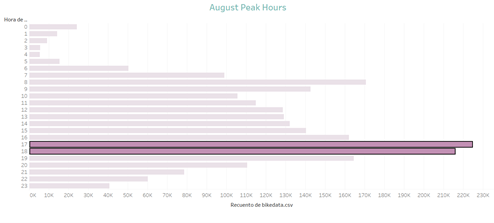
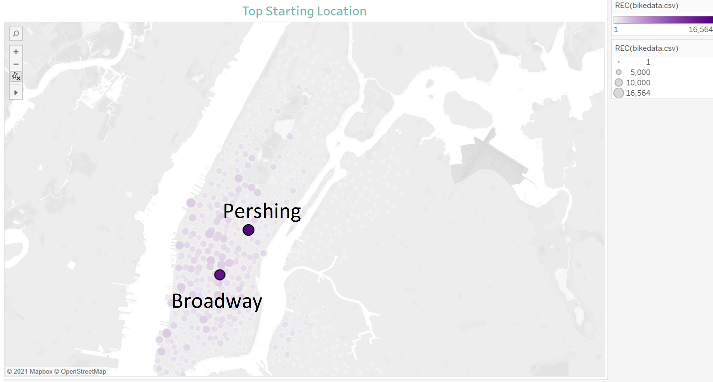
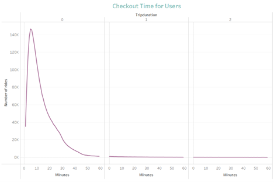
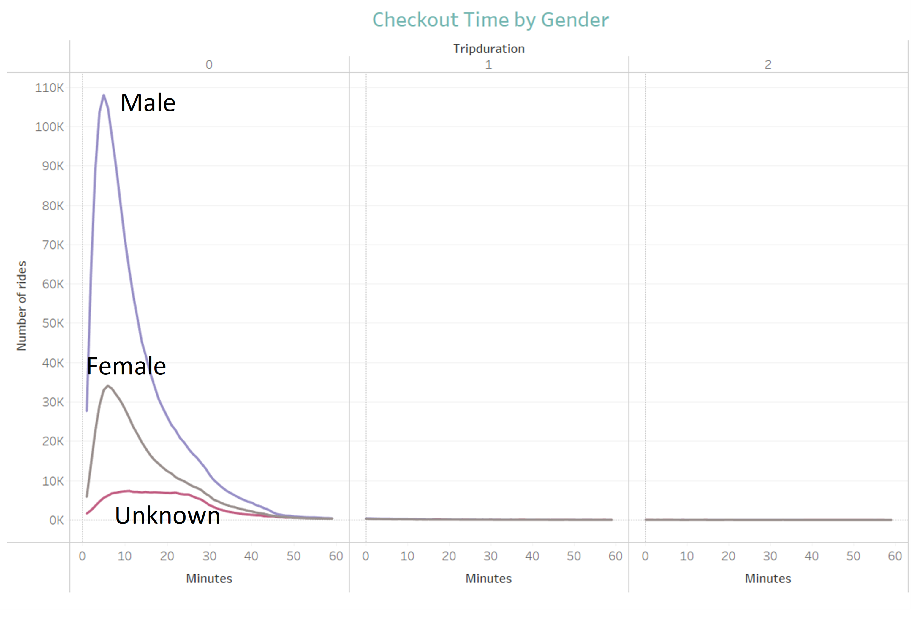
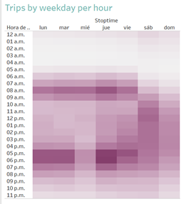
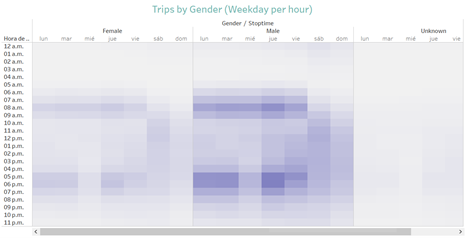
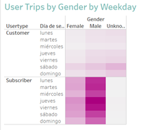

# CitiBike Analysis

## OVERVIEW

### Purpose

The purpose of this analysis is to create the visualizations and their corresponding analysis in order to present a bike sharing program in Des Moines to a potential Angel investor. The job is to analyze how the business actually works in New York City , and based on that data, create a proposal that could work for the project development on Des Moines.

## ANALYSIS

### Results

Using the information obtained from the available databases of Citi Bike, major information was found.
1.	The total number of rides in the month of august (the one with more use of bikes) were 2’344,224

2.	As we can see, the peak hours of usage are from 5 pm to 6 pm, with a total of 440,349 bike rides, just in both

3.	From all the start locations available, the one with more users is the one of Pershing Square North, with a record of 16,564 rides, followed by the one in E17 St & Broadway, with 14,345 rides

4.	The trip duration information includes rides from 5 minutes until 23 hours, being the short lapses of time, the popular ones, being 5 minutes the ride duration with more records (146,752). As we can see in the graph below, the peak of five minutes decreases until it reaches 1 hour, and from here until 23 hours, the contribution is marginal with less number or rides

5.	Following with the checkout time analysis, the total of rides is divided by gender, being the men, the ones with more bike usage. In the 5 minutes peak,  108,087 of the total of 146,752 rides were made by males, leaving only 34,151 for the females and 5,624  with gender unknown

6.	If we see the day and hour with more bike usage, we can identify that Thursdays are the days with more concentration. Just as seen before, in the evenings between 5 pm and 6 pm is the period with more bike demand with a total of 88,887 rides

7.	Just a more detailed plot from the information above, divided by gender, the user tendency remains the same, being the men the ones that uses more the bikes, also in Thursdays on the hours previously defined

8.	Finally, a difference between customers and subscribers can be seen. Accordingly with what we saw earlier, the subscribers that use the more the bikes are male on Thursdays  with 259,316 rides, followed by Friday with 233,638 rides

## SUMMARY

From all the information obtained from de data of New York City Citi Bike, we can conclude that, in order to create the project in Des Maines, is necessary:

    •Have a lot of starting locations, including the most popular places on the city

    •Know that the trip duration is very short most of the times, with approximately the 80% of the rides being between 5 minutes and one hour

    •Being clear that, in all cases, the males are the vast majority of bike users

    •Know that the daytime with more rides is in the late evening, between 5 pm and 6 pm

    •It should be expected that weekends will be the days with more demand, but curiously, Thursdays and Fridays are the days with more bike usage

To finalize the analysis, we can also use visualizations that includes other months of the year and compare them with August, and also, we could use the birth year in order to identify other usage preferences.

## Tableau link

[link to dashboard](https://public.tableau.com/app/profile/ayesha.carre.o/viz/CitiBikeChallenge_16324590089370/CitiBike?publish=yes)
